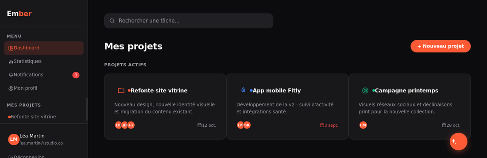
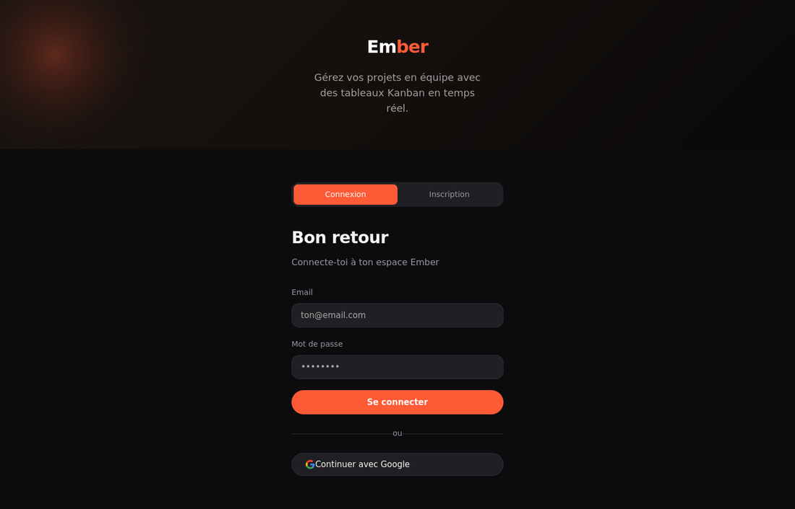
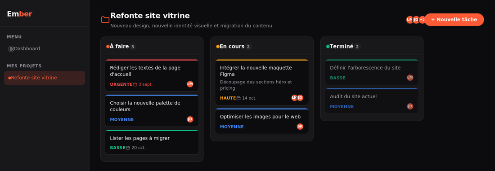
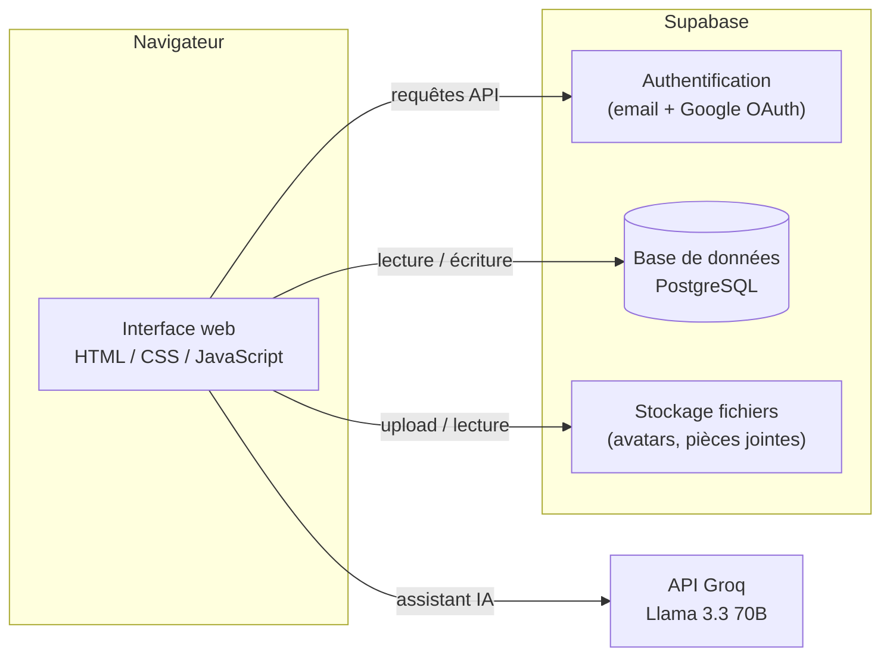

# Ember

Application web de gestion de projet et de tâches, avec assistant IA intégré.

## Aperçu

Ember permet à une équipe de gérer ses projets sur des tableaux kanban personnalisables, avec gestion des rôles, suivi de l'avancement et un assistant IA contextuel disponible sur chaque tâche.

| | |
|---|---|
|  |  |

## Fonctionnalités

- **Tableaux kanban** personnalisables par projet, avec priorités et échéances
- **Fiches tâches** complètes : sous-tâches, commentaires, pièces jointes
- **Gestion d'équipe** avec rôles (admin / membre / observateur) et invitations par email
- **Vue "Ma tâche"** : accès restreint pour un collaborateur externe, qui voit et termine uniquement sa tâche assignée
- **Profil public partageable**, façon portfolio, montrant les projets partagés
- **Statistiques** par projet : tâches non assignées, tâches urgentes, charge par membre
- **Assistant IA contextuel** sur le tableau de bord, les projets et les tâches (API Groq, Llama 3.3 70B)
- Authentification email/mot de passe et Google OAuth

## Architecture

Aucun serveur applicatif à maintenir : le frontend est un site statique qui parle directement à Supabase (base de données, authentification, fichiers) et à l'API Groq pour l'assistant IA.

## Stack technique

| Composant | Technologie |
|---|---|
| Frontend | HTML / CSS / JavaScript pur, multi-pages, sans framework |
| Backend | Supabase (PostgreSQL, Auth, Storage) |
| IA | API Groq — modèle Llama 3.3 70B |
| Design | Système de design sur variables CSS, police Inter, icônes Material Symbols |

## Modèle de données

`profiles` · `projects` · `project_members` (rôles) · `columns` (kanban) · `tasks` · `subtasks` · `comments` · `attachments` · `notifications`

## Déploiement

Site statique, déployable sur Netlify, Vercel ou Cloudflare Pages. Nécessite un projet Supabase (variables d'URL et clé publique dans `js/supabase.js`) et une clé API Groq **côté serveur** (fonction serverless recommandée, pas de clé exposée côté client).

## Pistes d'évolution

- Assistant IA proactif : détection automatique des tâches à risque, résumé périodique du projet, création de tâches à partir de notes de réunion
- Suivi du temps passé par tâche
- Export PDF des statistiques
- Lien externe sans compte pour la validation client
